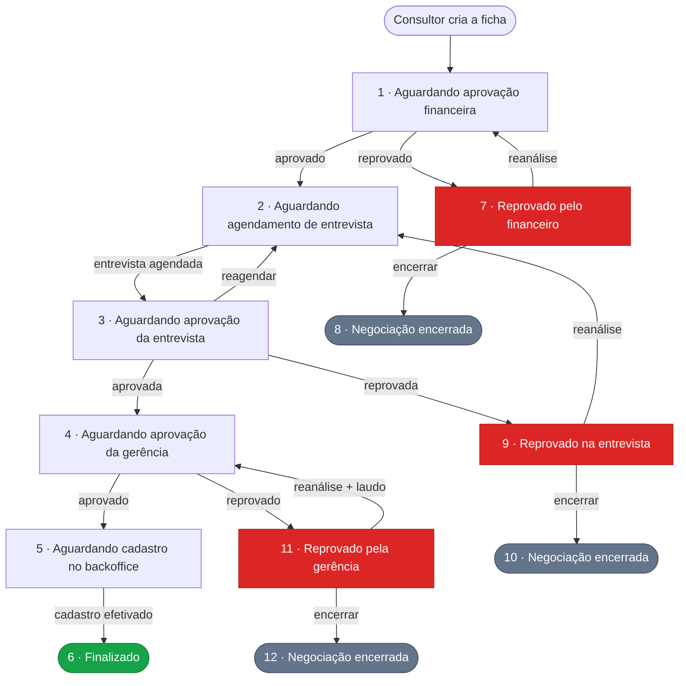

<h1 align="center">Sistema de Entrevista de Adesão</h1>

<p align="center">
  Aplicação web para gestão do fluxo de adesão de beneficiários a planos de saúde —<br>
  do cadastro da ficha pelo consultor até a efetivação do contrato pelo backoffice.
</p>

<p align="center">
  
  
  
  
  
</p>

<p align="center">
  <a href="#sobre-o-projeto">Sobre</a> ·
  <a href="#funcionalidades">Funcionalidades</a> ·
  <a href="#fluxo-do-processo">Fluxo</a> ·
  <a href="#stack">Stack</a> ·
  <a href="#como-executar">Como executar</a> ·
  <a href="#endpoints">Endpoints</a>
</p>

---

## Sobre o projeto

O processo de adesão de um novo beneficiário a um plano de saúde passa por várias mãos: o consultor
de vendas monta a ficha e anexa a documentação, o financeiro avalia a viabilidade, uma entrevista
médica é agendada e analisada, a gerência dá o aval final e só então o backoffice efetiva o cadastro.

Quando esse trâmite é feito por planilhas, e-mails e mensagens soltas, ninguém sabe onde a ficha
está parada, documentos se perdem e reprovações não deixam rastro.

Esta aplicação centraliza todo esse fluxo em um único sistema, com **12 status bem definidos** que
a ficha percorre. Cada etapa tem sua própria tela, seu próprio responsável e registra quem aprovou,
quando aprovou e com qual observação. Fichas reprovadas não morrem: cada setor oferece a opção de
**solicitar reanálise** (devolvendo a ficha à etapa anterior) ou **encerrar a negociação**,
mantendo o histórico completo para consulta.

> **Nota:** projeto desenvolvido como estudo de caso de um processo real de operadora de saúde.
> Nomes, dados e documentos usados em demonstração são fictícios.

---

## Funcionalidades

### Vendas

- Cadastro completo da ficha de adesão em formulário multi-etapas com validação no cliente
- Suporte a beneficiário titular e dependente, portabilidade de carências, descontos e observações especiais
- Cadastro de múltiplos responsáveis pela inclusão por ficha
- Upload de documentos (`.pdf`, `.jpg`, `.jpeg`, `.png`) com limite total de 20 MB por envio
- Criação **atômica**: ficha, responsáveis e documentos são gravados em uma única transação — se algo falhar, o rollback desfaz o banco e remove os arquivos já salvos em disco
- Acompanhamento das fichas enviadas e do status atual de cada uma
- Agendamento e reagendamento da entrevista médica

### Financeiro

- Fila de fichas aguardando aprovação financeira
- Aprovação ou reprovação com observação registrada e carimbo de quem revisou
- Download de todos os documentos anexados em um único `.zip`, nomeado pelo beneficiário
- Tela dedicada a fichas reprovadas, com opção de reanálise ou encerramento da negociação

### Entrevistas

- Fila de entrevistas agendadas com data, hora e observações do agendamento
- Análise da entrevista com aprovação/reprovação e parecer do entrevistador
- Estrutura de banco preparada para o questionário de saúde estruturado (mais de 140 itens de declaração)

### Gerência

- Aprovação final da ficha, já com todo o histórico das etapas anteriores visível
- Observações pré-definidas que podem ser anexadas ao parecer com um clique
- Solicitação de reanálise acompanhada de **laudo médico anexado** e observação obrigatória

### Administração

- Gestão de usuários, com filtros por cargo e setor
- Cargos (`administrator`, `employee`) e setores configuráveis via banco
- Dashboard com a visão consolidada das fichas por status

---

## Fluxo do processo



Cada transição de status é validada no *service* antes de ser aplicada — não é possível, por
exemplo, analisar uma entrevista de uma ficha que não esteja no status 3, nem finalizar o cadastro
de uma ficha que não esteja no status 5.

---

## Stack

| Camada | Tecnologia |
| --- | --- |
| Backend | [Flask 3.1](https://flask.palletsprojects.com/) (blueprints, sem ORM) |
| Banco de dados | [PostgreSQL](https://www.postgresql.org/) via [psycopg 3](https://www.psycopg.org/psycopg3/) com `dict_row` |
| Templates | [Jinja2](https://jinja.palletsprojects.com/) renderizado no servidor |
| Frontend | HTML, CSS e JavaScript ES6 modules — **sem framework e sem build step** |
| Autenticação | [PyJWT](https://pyjwt.readthedocs.io/) em cookie `HttpOnly` |
| Senhas | [Argon2](https://argon2-cffi.readthedocs.io/) (`argon2-cffi`) |
| Servidor de produção | [Waitress](https://docs.pylonsproject.org/projects/waitress/) |
| Notificações no cliente | [Notyf](https://github.com/caroso1222/notyf) |

A escolha por **SQL puro em vez de ORM** foi deliberada: o domínio tem consultas agregadas pesadas
(uma ficha reúne responsáveis, aprovação financeira, entrevista, parecer da gerência, solicitações
de reanálise e documentos) e escrever o SQL diretamente deixa explícito o custo de cada consulta.

---

## Arquitetura

O backend segue uma separação em três camadas, com responsabilidades bem delimitadas:

```
routes/     ->  Controllers: recebem a requisição, extraem os dados e traduzem exceções em HTTP
services/   ->  Regras de negócio: validações, transições de status, orquestração de transações
models/     ->  Acesso a dados: SQL e mapeamento para objetos Python
```

A regra prática é que um *controller* nunca escreve SQL e um *model* nunca decide regra de negócio.

```
api_entrevista_vendas/
├── app.py                      # Fábrica da aplicação, limite de upload e entrypoint
├── configs.py                  # Registro de todos os blueprints sob o prefixo /entrevista-adesao
├── requirements.txt
├── database/
│   ├── connect_db.py           # Conexão com o PostgreSQL
│   └── migrations/             # DDL das tabelas e carga dos status
├── middlewares/
│   ├── jwt_middleware.py       # @token_required — valida o JWT do cookie
│   └── permissions.py          # @role_required — restringe por cargo
├── models/                     # Uma classe Model + uma dataclass por tabela
├── routes/
│   ├── *_controller.py         # Endpoints de API (JSON)
│   └── render_pages/           # Blueprints que renderizam as páginas Jinja
├── services/                   # Regras de negócio por domínio
├── static/
│   ├── css/                    # Um arquivo por tela + global.css e navbar.css
│   ├── js/
│   │   ├── utils/              # apiHelper, dateUtils, toast
│   │   └── *Modals/            # Modais isolados por contexto de tela
│   └── img/
├── templates/                  # Uma página Jinja por tela
└── upload_docs/                # Documentos anexados (fora do controle de versão)
```

### Modelo de dados

| Tabela | Papel |
| --- | --- |
| `users`, `roles`, `sectors` | Usuários do sistema, seus cargos e setores |
| `form_status` | Os 12 status possíveis de uma ficha |
| `application_forms` | Tabela central — dados do plano, do beneficiário, portabilidade e desconto |
| `inclusion_responsibles` | Responsáveis pela inclusão (N por ficha) |
| `application_form_documents` | Documentos anexados, com tipo (`adesao`, `laudo_medico`) e caminho em disco |
| `application_form_approvals` | Parecer do financeiro |
| `application_form_interviews` | Agendamento e análise da entrevista |
| `application_form_management` | Parecer da gerência |
| `application_form_reanalysis_requests` | Histórico de solicitações de reanálise |
| `qualify_interview` | Declaração de saúde estruturada, com mais de 140 itens de resposta |

---

## Como executar

### Pré-requisitos

- [Python 3.13+](https://www.python.org/downloads/)
- [PostgreSQL 14+](https://www.postgresql.org/download/) em execução

### 1. Clonar o repositório

```bash
git clone https://github.com/joao-v-marques/entrevista_vendas.git
```

### 2. Criar e ativar o ambiente virtual

```bash
python -m venv .venv
```

Windows (PowerShell):

```bash
.venv\Scripts\Activate.ps1
```

Linux / macOS:

```bash
source .venv/bin/activate
```

### 3. Instalar as dependências

```bash
pip install -r requirements.txt
```

### 4. Criar o banco de dados

```bash
psql -U postgres -c "CREATE DATABASE entrevista_adesao;"
```

Em seguida, execute o DDL das tabelas:

```bash
psql -U postgres -d entrevista_adesao -f database/migrations/V1__create_tables.sql
```

O arquivo `database/migrations/V1__form_status.sql` contém os 12 status de referência
(`id`, `name`, `description`) que devem ser carregados na tabela `form_status` antes do primeiro uso.
As tabelas `roles` e `sectors` também precisam ser populadas — os cargos esperados pelo frontend são
`administrator` e `employee`.

### 5. Configurar as variáveis de ambiente

Crie um arquivo `.env` na raiz do projeto:

```env
SECRET_KEY=troque-por-uma-chave-longa-e-aleatoria
FLASK_ENV=development

DB_HOST=localhost
DB_PORT=5432
DB_NAME=entrevista_adesao
DB_USER=postgres
DB_PASSWORD=sua-senha
```

| Variável | Descrição |
| --- | --- |
| `SECRET_KEY` | Chave usada para assinar os tokens JWT. Obrigatória |
| `FLASK_ENV` | `development` roda o servidor de debug do Flask; qualquer outro valor sobe o Waitress na porta 5005 |
| `DB_HOST` | Host do PostgreSQL |
| `DB_PORT` | Porta do PostgreSQL |
| `DB_NAME` | Nome do banco |
| `DB_USER` | Usuário do banco |
| `DB_PASSWORD` | Senha do banco |

### 6. Subir a aplicação

```bash
python app.py
```

Em `development`, a aplicação sobe em `http://127.0.0.1:5000`. Nos demais ambientes, o Waitress
escuta em `http://0.0.0.0:5005` com 8 threads.

Acesse: **`http://localhost:5005/entrevista-adesao/login`**

> O primeiro usuário precisa ser criado direto no banco (ou via `POST /users`), já que a tela de
> gestão de usuários exige uma sessão autenticada.

---

## Endpoints

Todas as rotas são registradas sob o prefixo **`/entrevista-adesao`**.

### Páginas

| Método | Rota | Descrição |
| --- | --- | --- |
| `GET` | `/login` | Tela de login |
| `GET` | `/home` | Página inicial com os atalhos por setor |
| `GET` | `/dashboard` | Visão consolidada das fichas |
| `GET` | `/nova-ficha` | Seleção do tipo de ficha |
| `GET` | `/nova-ficha/formulario` | Formulário de adesão |
| `GET` | `/fichas` | Fichas cadastradas pelo consultor |
| `GET` | `/aprovar-ficha` | Fila de aprovação financeira |
| `GET` | `/fichas-reprovadas` | Fichas reprovadas pelo financeiro |
| `GET` | `/agendar-entrevista` | Agendamento de entrevistas |
| `GET` | `/analisar-entrevista` | Análise das entrevistas realizadas |
| `GET` | `/fichas-reprovadas-entrevista` | Fichas reprovadas na entrevista |
| `GET` | `/aprovar-gerencia` | Fila de aprovação da gerência |
| `GET` | `/fichas-reprovadas-gerencia` | Fichas reprovadas pela gerência |
| `GET` | `/usuarios` | Gestão de usuários |

### Autenticação

| Método | Rota | Descrição |
| --- | --- | --- |
| `POST` | `/login` | Autentica e devolve o JWT em cookie `HttpOnly` (8h de validade) |
| `GET` | `/me` | Dados do usuário logado. Exige token |
| `POST` | `/logout` | Expira o cookie de sessão |

### Fichas de adesão

| Método | Rota | Descrição |
| --- | --- | --- |
| `GET` | `/application-forms` | Lista todas as fichas |
| `GET` | `/application-forms/status?status_id=` | Lista as fichas de um status específico |
| `GET` | `/application-forms/{id}/details` | Retorno agregado: ficha, responsáveis, aprovações, entrevista, reanálises e documentos |
| `POST` | `/application-forms/complete` | Cria ficha + responsáveis + documentos em uma transação (`multipart/form-data`) |
| `POST` | `/application-forms/{id}/request-reanalysis` | Reanálise financeira: status 7 volta para 1 |
| `POST` | `/application-forms/{id}/close-negotiation` | Encerra a negociação após reprovação financeira (status 8) |
| `POST` | `/application-forms/{id}/finalize` | Efetiva o cadastro: status 5 avança para 6 |

### Responsáveis pela inclusão

| Método | Rota | Descrição |
| --- | --- | --- |
| `GET` | `/inclusion-responsibles` | Lista os responsáveis cadastrados |
| `POST` | `/inclusion-responsibles` | Cadastra um responsável |

### Documentos

| Método | Rota | Descrição |
| --- | --- | --- |
| `GET` | `/application-form-documents` | Lista os metadados de todos os documentos |
| `GET` | `/application-form-documents/{application_form_id}/download` | Baixa todos os anexos da ficha em um `.zip` |
| `GET` | `/application-form-documents/{document_id}/file` | Abre um documento no navegador; `?download=true` força o download |
| `POST` | `/application-form-documents` | Anexa documentos a uma ficha existente |

### Aprovação financeira

| Método | Rota | Descrição |
| --- | --- | --- |
| `GET` | `/application_form_approval` | Lista os pareceres financeiros |
| `POST` | `/application_form_approval` | Registra o parecer e move a ficha para o status 2 ou 7 |

### Entrevistas

| Método | Rota | Descrição |
| --- | --- | --- |
| `GET` | `/application-form-interviews` | Lista as entrevistas |
| `POST` | `/application-form-interviews` | Agenda a entrevista |
| `PUT` | `/application-form-interviews` | Registra a análise da entrevista (aprovação ou reprovação) |
| `DELETE` | `/application-form-interviews?application-form-id=` | Cancela o agendamento e devolve a ficha ao status 2 |
| `POST` | `/application-form-interviews/{id}/request-reanalysis` | Reanálise da entrevista: status 9 volta para 2 |
| `POST` | `/application-form-interviews/{id}/close-negotiation` | Encerra a negociação após reprovação na entrevista (status 10) |

### Gerência

| Método | Rota | Descrição |
| --- | --- | --- |
| `GET` | `/application_form_management` | Lista os pareceres da gerência |
| `POST` | `/application_form_management` | Registra o parecer e move a ficha para o status 5 ou 11 |
| `POST` | `/application_form_management/{id}/request-reanalysis` | Reanálise com laudo médico anexado: status 11 volta para 4 (`multipart/form-data`) |
| `POST` | `/application_form_management/{id}/close-negotiation` | Encerra a negociação após reprovação da gerência (status 12) |

### Usuários, cargos e setores

| Método | Rota | Descrição |
| --- | --- | --- |
| `GET` | `/users` | Lista os usuários |
| `GET` | `/users/{id}` | Busca por ID |
| `GET` | `/users/{username}` | Busca por nome de usuário |
| `POST` | `/users` | Cria um usuário (senha com hash Argon2) |
| `PUT` | `/users/{id}` | Atualiza um usuário |
| `DELETE` | `/users/{id}` | Remove um usuário |
| `GET` | `/roles` | Lista os cargos |
| `GET` | `/sectors` | Lista os setores |

---

## Segurança

- Senhas armazenadas com **Argon2**, o algoritmo recomendado atualmente para hashing de senhas
- Sessão em **JWT dentro de cookie `HttpOnly`** com `SameSite=Lax`, inacessível ao JavaScript da página e com expiração de 8 horas
- Downloads de documentos validam o caminho absoluto contra a raiz de uploads, bloqueando *path traversal*
- Nomes de arquivo passam por `secure_filename` antes de tocar o disco
- Limite de **21 MB por requisição**, com resposta `413` em JSON para o frontend tratar
- Dados vindos do backend são escapados antes de qualquer inserção via `innerHTML`

> **Ponto em aberto:** apenas as rotas de renderização e `/me` exigem token hoje. A proteção dos
> demais endpoints de API com `@token_required` e `@role_required` — os decorators já estão prontos
> em `middlewares/` — é o próximo passo antes de qualquer exposição fora de uma rede interna.
> Ao rodar sob HTTPS, o cookie de sessão também deve ser emitido com `secure=True`.

---

## Licença

Distribuído sob a licença MIT. Consulte o arquivo [LICENSE](LICENSE) para mais detalhes.

---

<p align="center">
  Desenvolvido por <a href="https://github.com/joao-v-marques">João Victor Marques</a>
</p>
